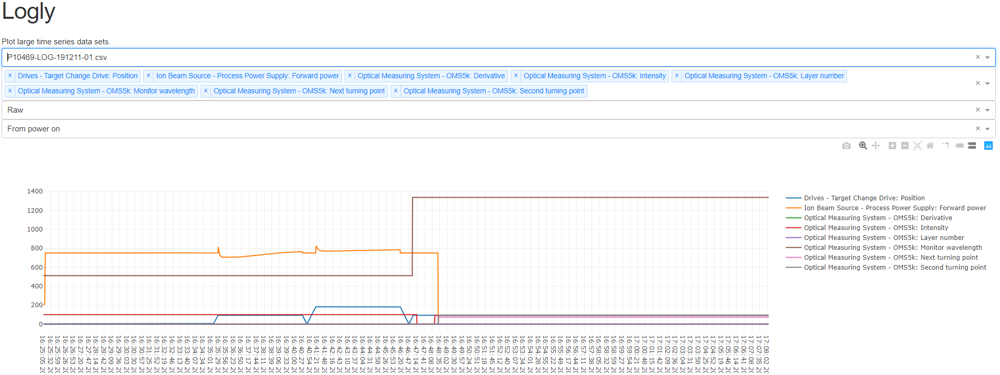

# Logly

##About

Implementation of the plotly python library to plot time series data, this implementation overcomes the 150 mb limitation of the default upload feature of plotly by implementing a streamlined pandas based loading of csv files. 



## Installation

### Prerequisites

1. Docker desktop
2. Python 3.7+

```bash
pip install -e .
```

## Development

### Virutal env on Native OS

From the project root, run the following command:

```bash
python3 -m venv venv
```

Then activate as typical on your native OS.

### Running on Windows

#### First run
```bash
docker-compose up
```

#### On change to code
```bash
docker-compose build
docker-compose run
```
